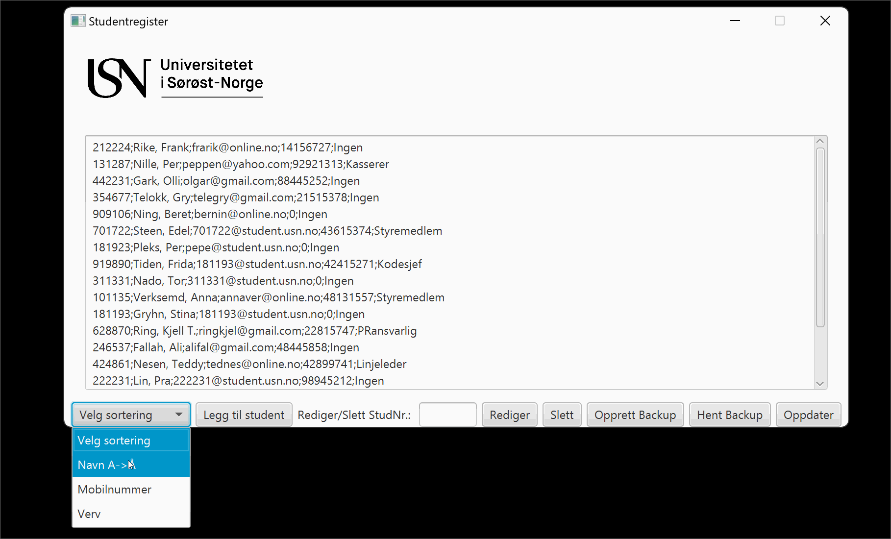

# StudentregisterGUI
Obligatorisk oppgave 2. 
Programmet oppretter db studenter og legger inn data fra tekstfil "studentregister.txt". Deretter får bruker opp en meny med ulike valg for endringer og visning av innhold i tabellen Student.
Oppgaven ble løst før jeg lærte objektorientert programmering. Derfor er all kode i samme fil. 
Utvikler: Bjarne Hovd Beruldsen. 

## Visning 

